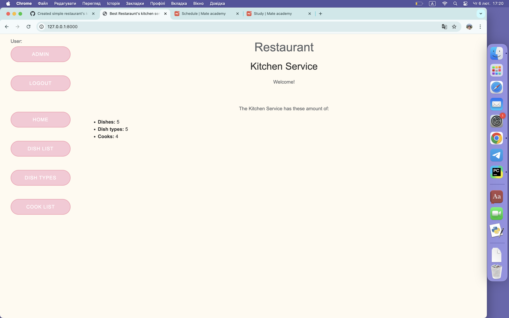
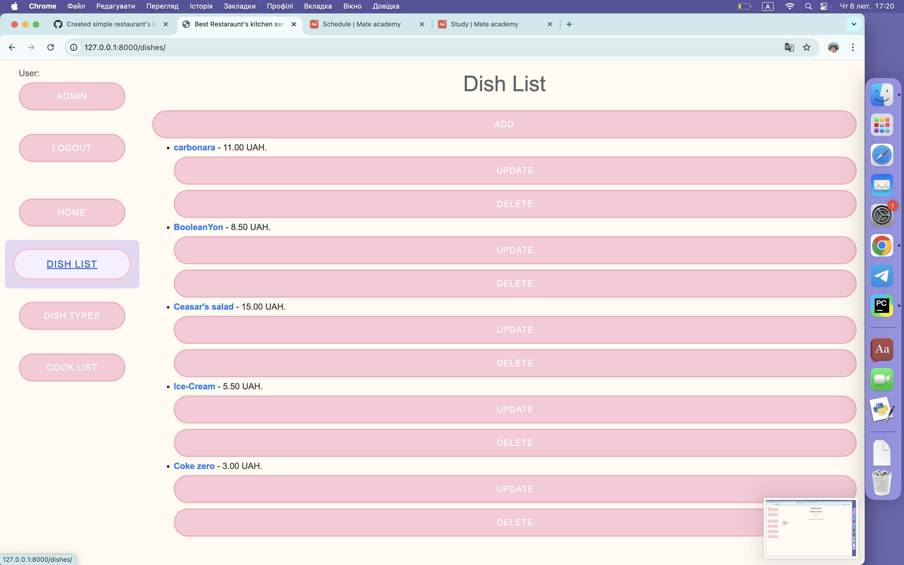
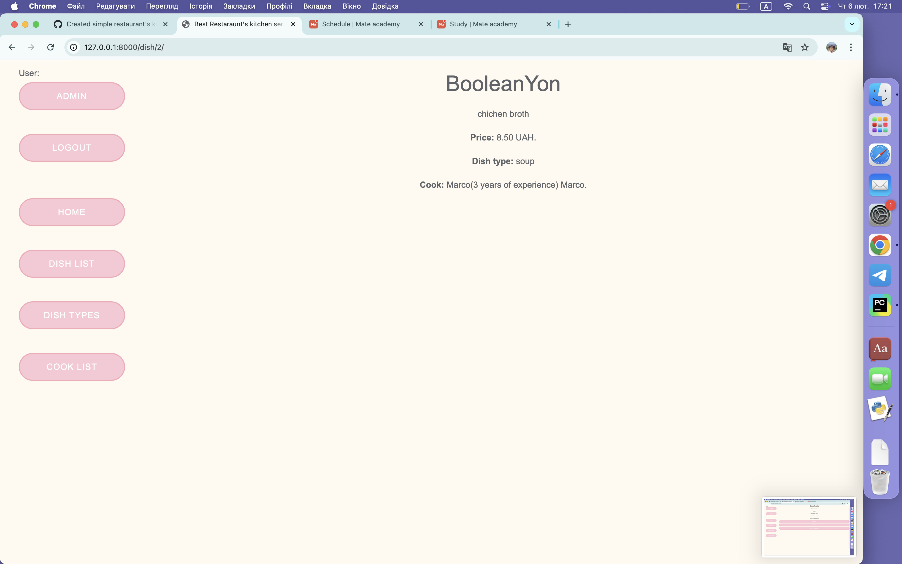

# Restaurant Kitchen Service

This is a Django-based web application for managing a restaurant's kitchen service. It allows users to manage dishes, cooks, and their details.

## Features
- User authentication with login required for all views.
- CRUD operations for Dishes.
- CRUD operations for Cooks.
- Custom login functionality with a "remember me" option.
- Homepage displaying the total number of dishes.

## Technologies Used
- Django
- Django ORM
- SQLite (default database)

## Installation

### Clone the repository:
```bash

git clone https://github.com/shretsker/kitchen_service.git
cd kitchen-service


Create a virtual environment and activate it:
python -m venv venv
source venv/bin/activate  # On Windows use: venv\Scripts\activate

Apply database migrations:
python manage.py makemigrations
python manage.py migrate


To populate the database with data from a file (data.json):
python manage.py loaddata data.json

Use Username: admin and Password: admin OR Create a superuser (admin account):
python manage.py createsuperuser

Run the development server:
python manage.py runserver

To use static files:
python manage.py collectstatic

Project Structure:
kitchen-service/                    # Django project
│-- __init__.py                     # File for initializing
│-- asgi.py                         # Asynchronous Server Gateway Interface
│-- settings.py                     # Settings of the project
│-- urls.py                         # Routes to app and administrating
│-- wsgi.py                         # Web Server Gateway Interface
│-- kitchen/                        # Django app
│   │-- migrations/                 # Migrations to db
│   │-- __init__.py                 # File for initializing
│   │-- admin.py                    # File for registering models
│   │-- apps.py                     # File for configuration of the app
│   │-- forms.py                    # Forms
│   │-- models.py                   # Database models for Dish and Cook
│   │-- tests.py                    # Unit tests
│   │-- urls.py                     # Routes to app views
│   │-- views.py                    # Views handling HTTP requests
│-- static/                         # Static files (CSS, JavaScript)
│-- staticfiles/                    # Empty directory to collect static for rendering
│-- templates/                      # HTML templates
│-- .gitignore                      # File which contains exclusions for commits
│-- dump.json                       # File to dump the data
│-- data.json                       # File fixture to load data to db
│-- db.sqlite3                      # SQLite database (if using default settings)
│-- manage.py                       # Django's command-line utility
│-- README.md                       # Descriptions and instructions


